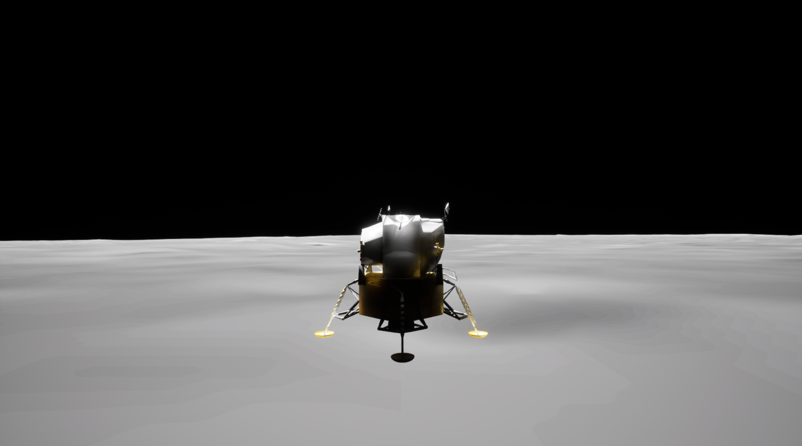

# Autonomous Lunar Lander using Soft Actor-Critic (SAC)

This project implements an **AI-powered autonomous lunar lander** using the **Soft Actor-Critic (SAC)** reinforcement learning algorithm. The agent is trained to perform safe and efficient landings on diverse lunar terrains simulated using **Unreal Engine 5** with Cesium integration. It aims to overcome the limitations of traditional rule-based systems by introducing real-time control, adaptability, and decision-making in unknown environments.

---

## Overview

Autonomous lunar landing presents significant challenges due to unpredictable terrain, delayed communication, and real-time hazard handling. This project focuses on training an SAC-based agent to:

- Learn optimal thrust and orientation for soft landings
- Adapt to variable terrain and environmental noise
- Operate in a **high-fidelity 3D simulation** of the lunar surface


[](https://drive.google.com/file/d/19TFTuzj88FmSJ7o8BLVCeeI7VYIKLh6v/view?usp=drive_link)
---

## Core Technologies

- **Soft Actor-Critic (SAC):** A continuous control reinforcement learning algorithm that optimizes both performance and entropy for stability and exploration.
- **Unreal Engine 5 + Cesium:** For realistic simulation of lunar terrain using actual elevation data.
- **OpenAI Gym:** Custom environment wrapper to interface the simulation with Python-based RL code.
- **Varest Plugin:** Real-time communication between Python AI models and Unreal Engine.

---

## Training Setup

- **State Space:** Altitude, velocity, orientation, fuel level, etc.
- **Action Space:** Continuous thrust control in multiple axes
- **Reward Function:** Combines smooth landing velocity, fuel efficiency, and stability
- **Training Time:** ~100,000 steps with adaptive entropy

---

## Simulation

The lunar surface is rendered with Cesium’s digital elevation maps and Unreal Engine’s physics engine. The lander includes:
- Functional thrusters
- Real-time telemetry (altitude, orientation, velocity)
- Physics-based descent and impact handling

---

## 🛰️ Simulation Download Links (Unreal Engine)

| Purpose | Link |
|--------|------|
| Training Environment | [Download from Drive](https://drive.google.com/drive/folders/1XmV6gpCfsQzmRAYJkY0MUoovVqERBa1M?usp=drive_link) |
| Deployment Build | [Download from Drive](https://drive.google.com/drive/folders/1R2mTc_GDRCa5Q2y2snXSGrK7XvnOnd_G?usp=drive_link) |

---

## Running the Project

### Prerequisites
- Python 3.9+
- PyTorch
- OpenAI Gym

### 1. Clone the Repository

```
git clone https://github.com/JemimaJeffY/autonomous-lunar-lander-sac.git
cd autonomous-lunar-lander-sac
```

### 2. Start the Backend (SAC API)

```
cd backend
python app.py
```

### 3. Set Up and Run the Frontend

You must first create a React app:
```
npx create-react-app frontend
cd frontend
npm install @mui/material @emotion/react @emotion/styled @splinetool/react-spline
```
Then, replace the contents of frontend/src with the project’s frontend code (if available).

Finally, start the frontend:
```
npm start
```

## Results
- Achieved safe landings in the majority of the simulation episodes
- Smooth descent profiles under diverse terrain and gravity settings
- Fully modular pipeline for future deployment and testing

## Future Work
- Integrate SLAM for onboard terrain mapping
- Extend to Mars or asteroid landings
- Deploy on edge devices (Jetson Nano, Raspberry Pi)
- Multi-agent lander coordination

## License
This project is developed as part of academic work and is intended for research and educational use.
